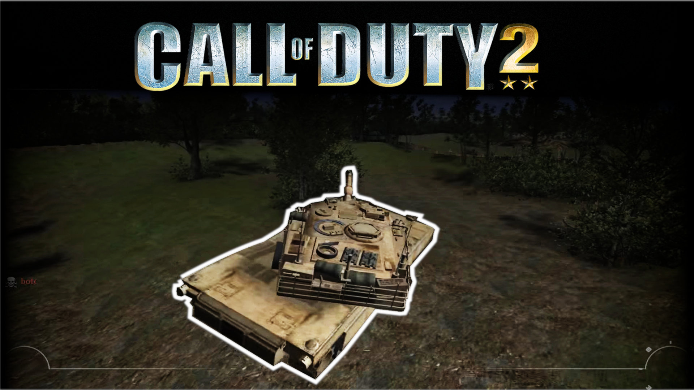
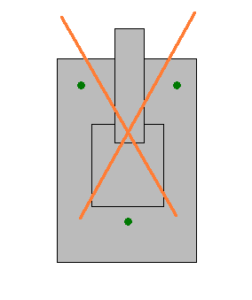

<h1 align="center">Call of Duty 2 - Tanks</h1>

<h4 align="center">Click on the image for a YouTube Preview:</h4>

## 

Clientside files are needed for running this.

## Setup

- This script is called from:
  - File: `maps\mp\gametypes\_callbacksetup.gsc`
  - Function: `CodeCallback_StartGameType()`
  - Call: `level thread serthy\main::init();`
- The Model was taken from: [tf3dm.com](http://tf3dm.com/3d-model/abrams-tank-17774.html)

### How does it work?

(This is entirely from memory, when I did this 7 years ago. You might want to check the UN vehicle mod in detail if you are intrested in that part, as I am not entirely confident in my memory on how they exactly did it.)

There is a (single, well known) vehicle mod in CoD2, the 'UN Vehicle Mod'.
It uses 4 `BulletTrace()` calls, on each wheel or ground contact point, to check where the ground is, and balances the vehicle based on the average.  
In addition to that, it uses multiple traces in a box form around the vehicle for collision detection with players, other vehicles or the terrain/buildings/trees.
I [mentioned here](https://killtube.org/showthread.php?1697-Player-Bounding-Volumes-%28Tank-Diskussion-Spinoff%29), that the UN mod uses around 20 traces for taht.
On each vehicle. Ten times a second.  
Traces in CoD2 are a rather expensive script-function to call, a few don't matter, but for the UN mod, it added up rather quickly, the mod became laggy with a handful of players driving around.

So for this mod, I approached it with this in my mind - to use as few traces as possible with a decent enough result.  
To align a vehicle with 4 wheels and no suspension, a static model (the only thing possible in CoD2), essentially a box, you only need 3 contact points on the ground.
So I use 3 traces for that (green), depending on the direction of driving, 2 in the front and 1 in the back.
To check for collisions I decided to use only up to 2 traces (orange). When the first one hits an obstacle, there is no need for the second trace. To get the best results the traces go in an X-shape, with its crossing slightly towards the front in the moving direction. This way you cover all the 4 edges of the vehicle and also counter the possibility to 'go too fast', skip a wall and the vehicle is inside an obstacle (and the box-like trace as in the UN mod wouldn't detect a hit). If I remember correctly, the arms also extend further depending on the speed to predict this even more. The downside is, you cannot detect hits on sideways motion or for example trees directly in the middle front.
In practice, this wasn't much of a problem though. You could't get rid of it by moving the vehicle back even more with an additional trace, but there is no need for that, especially with slow tanks.

So the version in this mod uses 4-5 traces every tenth of a second, meaning you could run more than twice the amount of vehicles compared to the UN mod.
Also the UN mod uses inefficient calculations (don't want to bash the mod, it was written way back when CoD2 came out and was the only CoD2 vehicle mod).

Also it monitors your buttons that you press with kind of a hack, see here: https://killtube.org/showthread.php?1702-key-on-keyboard

### TODO

- huds
  - target hud
  - tank hud + damage + rotation
- sound
  - idle
  - fire
  - rotation
  - drive
  - drive backwards
- damage
  - hud
  - fx
  - logic
  - respawn
  - explosion
- spawning
  - team logic
  - alignment
- devgui
  - manual spawn setup
  - debug lines
- fx
  - damage
  - drive
  - shot
  - impact
- gun rotation
  - check if its worth the coding
- anim
  - fake shot anim if its worth
- radiusdamage
  - implement scriptedradiusdamage
- model
  - add tags
  - fix track blend issue
  - combine tracks and body if no more anim is needed
  - modify gun model ifrotation issue isnt solved
